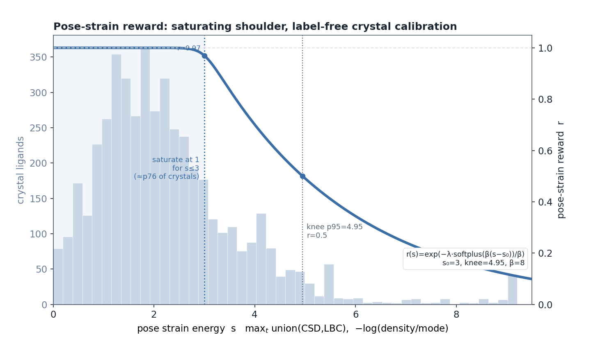
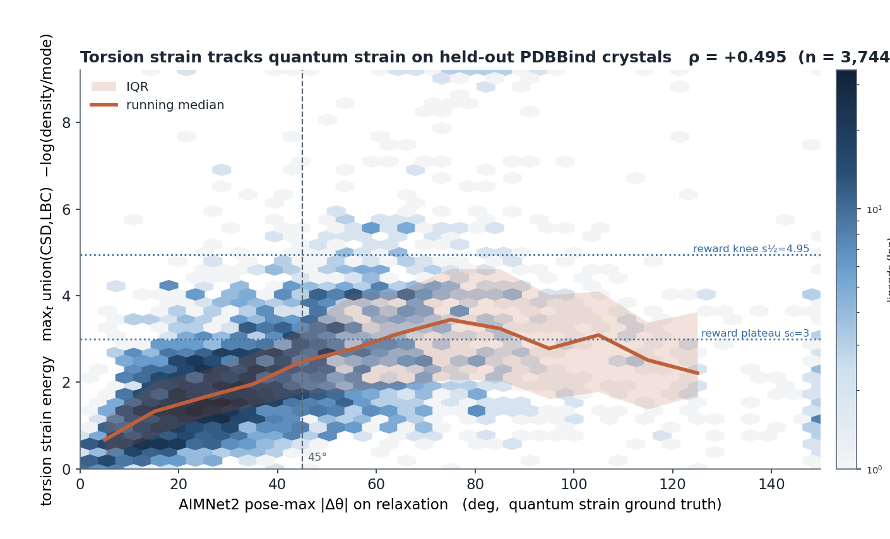

# genbench3d-strain — standalone torsion-strain pose scorer

A fork of [GenBench3D](https://github.com/bbaillif/genbench3d) (Baillif et al. 2024,
[arXiv:2407.04424](https://arxiv.org/abs/2407.04424)) packaged as a small, installable
**pose scorer** for protein–ligand design poses. It provides two complementary, geometry-only
strain scorers, both taking a **pose file (PDB/SDF/MOL2) + the ligand SMILES**:

1. **`torsion-strain`** *(recommended)* — a histogram-based **torsional-strain reward** validated
   against AIMNet2 (ωB97M+CPCM) relaxation. Each rotatable torsion is scored by how unusual its
   dihedral angle is relative to a reference of experimental structures, and the pose score is the
   most-strained torsion (max-pool). This is the finalized metric; its Methods are below.
2. **`sscore`** — the paper's **s-value**, the geometric mean of per-geometry *q-values* (a value's
   KDE likelihood normalised by the density's mode); plus **`pose-validity`** (GenBench3D's
   Validity3D bond/angle/clash/pucker gate).

Ligands are pulled from the file and their bond orders assigned from the SMILES template
(`AssignBondOrdersFromTemplate`), with a halogen/H over-bond prune for robustness on
predicted/minimized poses.

> This fork adds `genbench3d.torsion_strain` (+ the `torsion-strain` CLI), `genbench3d.pose_scorer`
> (+ `sscore`), `genbench3d.pose_validity` (+ `pose-validity`), a composable reference layer, and
> bundled open reference libraries. The upstream benchmark code is untouched and stays importable.
> See `LICENSE` (MIT) and the upstream repo for attribution.

## Torsion-strain reward (recommended)

`torsion-strain` estimates the conformational strain of a ligand pose from its rotatable torsions
alone — a fast, license-clean, geometry-only surrogate for a QM strain calculation, intended as a
reward for structure-based generative design.

### Methods

**Torsion patterns.** For a pose we take every *rotatable* torsion: a single, non-ring bond b–c
between two heavy atoms, with each heavy-atom neighbour a of b and d of c, giving the dihedral
a–b–c–d. Each torsion is assigned a coarse *pattern* from the atom types — atomic number,
aromaticity, and hybridization — of its four atoms, canonicalized so that a–b–c–d and d–c–b–a map
to one key. A two-atom *backoff* pattern is formed from the central pair (b, c) alone.

**Reference distributions.** From a reference set of experimentally-determined 3D structures we
accumulate, per pattern, a histogram of its dihedral over 36 bins of 10°. Because the sign of a
dihedral is arbitrary, each observation is entered at both θ and −θ. Histograms are smoothed with a
wrapped Gaussian kernel (σ = 1.5 bins ≈ 15°) and normalized to a density p(θ); we retain the
density, its mode p\* = maxθ p, and the observation count N.

**Per-torsion strain energy.** A torsion at angle θ is scored against the finest pattern with
adequate support: the four-atom pattern if N ≥ N_min, else the two-atom backoff if N ≥ N_min, else
the torsion is *uncovered*. A covered torsion's energy is

&nbsp;&nbsp;&nbsp;&nbsp;`e(θ) = −log( p(θ) / p* + ε )`,&nbsp;&nbsp; ε = 10⁻⁴,

a pseudo-energy in [0, −log ε ≈ 9.2] that is 0 at the modal angle and grows as the torsion enters
low-probability regions. The support threshold **N_min = 50** (per-pattern *count thresholding*)
stops a sparsely-observed pattern's noisy density from emitting spurious high energies; below it the
score falls back to the well-sampled two-atom pattern. Torsions uncovered by every reference
(chemistry absent from the data) receive a **neutral energy** — the reference's median per-torsion
energy — rather than the ceiling, so out-of-distribution torsions are neither spuriously penalized
nor able to evade the reward under max-pooling.

**Combining references and pooling.** Multiple references are combined by **union**: a torsion's
energy is the maximum over the references that resolve it (strained if *any* reference finds its
angle unusual). The **pose strain** is the maximum per-torsion energy over the ligand
(**max-pool**): a pose is as strained as its worst torsion.

**Design reward.** For reinforcement-learning or ranking use, `pose_reward()` maps the pose strain
`s` to a smooth reward in [0, 1] (higher = lower strain) via a **saturating softplus shoulder**

&nbsp;&nbsp;&nbsp;&nbsp;`r(s) = exp( −λ · softplus(β·(s − s₀)) / β )`,&nbsp;&nbsp;
`λ = ln 2 / softplus_excess(s_½)`,

which is **flat at 1 for `s ≤ s₀`** (the *crystallographic region*), passes through **0.5 at the knee
`s_½`**, and decays toward 0 for highly-strained poses (keeping a gentle tail gradient rather than a
hard cut). The plateau is deliberate: real crystals span a range of small strains, so rewarding a pose
for being *less* strained than a typical crystal would spend gradient — and trade against other
objectives — on differences below the noise floor of experimental structures; the reward should bite
only on genuine outliers. The anchors are **label-free**: scoring 4,788 PDBBind crystal ligands (real,
hence ~unstrained; held out of the library) with the union(custom-CSD + LigBoundConf) reference at
`N_min = 50` puts `s₀ = 3.0` at ~p76 of that distribution and `s_½ = 4.95` at p95 (defaults
`REWARD_PLATEAU`, `REWARD_KNEE`, `REWARD_BETA = 8`). Because the anchors live on the pose-strain scale of
the reference in use, a different `--reference` warrants recalibration: score a crystal set with it and
pass the percentiles from `calibrate_shoulder(crystal_energies)` to `pose_reward()`.



***Figure — Label-free calibration of the pose-strain reward.*** Grey histogram (left axis): pose strain
energy `s` for **4,788 PDBBind crystal ligands** — real, hence essentially unstrained, structures **held out
of the library** — where `s` is the max over a ligand's non-ring torsions of the −log(density/mode) energy
under the **union of the custom-CSD and LigBoundConf** references (`N_min = 50`). Blue curve (right axis): the
reward `r(s)`, a **saturating softplus shoulder** that is **flat at 1 through `s₀ = 3.0`** (≈ the 76th
percentile of the crystal distribution — the *crystallographic region*, shaded), crosses **`r = 0.5` at the
knee `s½ = 4.95`** (the crystal 95th percentile), and decays toward 0 for poses more strained than real
crystals. The plateau is the point: the reward does **not** distinguish among poses that are already as
unstrained as experimental structures, so it bites only on genuine outliers and can be combined
multiplicatively with other objectives without trading physically-irrelevant strain against them.
The strain metric underlying this reward is validated directly against a quantum-mechanical ground truth
(AIMNet2) on held-out crystals — see the validation figure below.

**Validation.** We validated against strain measured by relaxation with the AIMNet2 neural-network
potential (ωB97M + CPCM implicit solvent). For each pose we relaxed the isolated ligand to its
nearest local minimum and recorded, per torsion, the angular change |Δθ|; a torsion that rotates
substantially on relaxation was genuinely strained. The pose max-torsion energy correlates with the
pose-maximum |Δθ| at Spearman **ρ = 0.51** on protein-conditioned design poses and **ρ = 0.49** on
an independent set of 3,744 PDBBind crystal ligands — the latter showing a reference of *unbound*
crystal geometry transfers to *bound*, cross-domain poses. Among references, a curated **CSD**
subset (unbound crystals) is the strongest single detector, **LigBoundConf** (bound conformers) the
strongest openly-redistributable one, and their union the best overall; a **PDBBind**-bound
reference is measurably weaker for torsional strain. Note that angular strain |Δθ| conflates soft
and stiff rotors (a 45° swing is ~2–3 kcal/mol for a stiff torsion but < 0.5 for a floppy one); the
empirical density already encodes stiffness (a stiff torsion has a narrow distribution), and
calibrating against AIMNet2 ΔE in kcal/mol is a natural extension.



***Figure — Torsion strain vs a quantum-mechanical strain ground truth.*** For each of **3,744 held-out
PDBBind crystal ligands**: the torsion strain energy (y, max over non-ring torsions of −log(density/mode)
under the union CSD + LigBoundConf reference) against **AIMNet2 pose-max |Δθ|** (x) — the largest per-torsion
angular change when the isolated ligand is relaxed to its nearest local minimum, so a torsion that swings far
on relaxation was genuinely strained in the pose. Hexbin = ligand density (log); orange = running median with
IQR band. The metric rises monotonically with the quantum strain (**Spearman +0.50**), on a *cross-domain*
test — an *unbound*-crystal reference scoring *bound* crystal poses. Dotted blue lines mark where the shipped
reward saturates (`s₀ = 3`) and crosses 0.5 (`s½ = 4.95`): crystals below ~45° |Δθ| mostly sit in the plateau
(reward ≈ 1), and the strain climbs into the reward's transition region as the quantum strain grows.

### Usage

```bash
torsion-strain --pdb complex.pdb --smiles "Cc1ccccc1C(=O)N2CCOCC2"
# pose_strain=3.42  reward=0.8600  n_torsions=17  n_covered=17

torsion-strain --pdb pose.pdb --smiles "..." --reference ligboundconf --min-n 50
torsion-strain --batch poses.txt --smiles "<shared smiles>" --out strain.csv   # CSV has pose_strain + reward
torsion-strain --list-references                 # bundled libraries
# tune the reward shoulder: --reward-plateau S0 --reward-knee S_HALF --reward-beta B
```

```python
from genbench3d.torsion_strain import TorsionStrainLibrary, pose_reward
from genbench3d.pose_scorer import load_any
lib = TorsionStrainLibrary.load(["ligboundconf"], min_n=50)      # union: add more names/paths
s = lib.score_mol(load_any("pose.pdb", "..."))["pose_strain"]
print(s, pose_reward(s))                                         # strain energy, [0,1] design reward
```

The **only bundled reference is `ligboundconf`** — the strongest openly-redistributable torsional-strain
detector we measured (it also beats a full-PDBBind reference, which is why PDBBind is *not* shipped). The
strongest combination, `ligboundconf + <csd_custom>`, needs a locally-built CSD library (licensed — see
[Building references](#building-references-torsion-strain)). Uncoverable poses return `NaN`, never
crashing a batch.

### Building references (torsion-strain)

Any set of 3D structures becomes a library via `scripts/build_torsion_lib.py` (all patterns are kept with
their support count; `N_min` is applied at score time, so it need not be chosen here):

```bash
# LigBoundConf (public) — rebuilds the bundled default
python scripts/build_torsion_lib.py --in S2_LigBoundConf_minimized.sdf \
    --name ligboundconf --out genbench3d/data/torsion_libs/ligboundconf.pkl
# PDBBind crystal ligands (open) — for comparison; weaker than LigBoundConf, so not bundled
python scripts/build_torsion_lib.py --glob '/db/PDBBind/**/*_ligand.sdf' \
    --name pdbbind --out /tmp/pdbbind.pkl
```

#### CSD subset (licensed — not distributed)

The best single detector is a **custom CSD subset**: ~10⁵ high-quality, drug-relevant, *unbound* organic
crystals filtered from the full Cambridge Structural Database. It is CCDC-licensed — **neither the
structures nor a library derived from them are committed** — but licensed users can regenerate it. Copy
`.env.example` → `.env`, set `CSDHOME` (and, *only* if your host is not already activated,
`CCDC_LICENSING_CONFIGURATION`), then in the CCDC `csd-python-api` python:

```bash
python scripts/curate_csd_subset.py --out refdata/csd_custom/CSD_custom.mol2 --stride 3
```

which filters for organic, ordered, well-refined (R ≤ 7.5%), ambient-pressure, drug-relevant crystals
(element set, MW 150–800, ≥ 2 rotatable bonds; largest component only) and writes a MOL2 + refcode list.
Build the library (RDKit side) and use it, unioned with the bundled default:

```bash
python scripts/build_torsion_lib.py --in refdata/csd_custom/CSD_custom.mol2 \
    --name csd_custom --out refdata/csd_custom/csd_custom.pkl
torsion-strain --pdb pose.pdb --smiles "..." \
    --reference genbench3d/data/torsion_libs/ligboundconf.pkl+refdata/csd_custom/csd_custom.pkl
```

## The s-value scorer (`sscore`)

The paper's headline s-value covers **bonds + valence angles** and deliberately *excludes*
torsions (binding-induced torsional strain is legitimate, not a geometry error). This tool's
default is the mirror image — a **torsion s-value** over the freely-varying dihedrals — which
we validated as a strain reward: it separates crystal from strained design poses and, within a
single molecule, tracks an independent torsion-strain metric for 100% of ligands tested.

**Default recipe:** `geometry=torsion`, `torsions=nonring`, `tiers=exact+gen_outer`,
`reference=pdbbind_full`. `s_value ∈ [0,1]`; higher = less strained (more reference-like).

Reference choice (crystal−design gmean(q) separation, bigger = better discriminator):

| reference (`--reference`) | design coverage | separation |
|---|---|---|
| **`pdbbind_full`** (default, 19.4k, bundled) | 92.5% | **+0.222** |
| `ligboundconf` (paper's open ref, bundled) | 86.8% | +0.175 |
| CSD-drug (external, licensed) | 77.6% | +0.121 |

Generalization tiers and the ring/rotatable choice matter: `nonring` + `exact+gen_outer`
(dropping the aggressive inner-neighbour tier and geometrically-stereotyped ring torsions)
is the strongest torsion discriminator we measured.

## Install

```bash
pip install -e .        # editable is recommended — avoids copying ~420 MB of weights into site-packages
# or:  pip install .
```

The large reference KDE pickles are committed **chunked** (`*.part*`, < 50 MB each, under
GitHub's limit) and **reassembled on first use** into the package's `data/weights/` dir
(the reassembled `.p` is git-ignored). No git-lfs needed.

## Usage

Single pose:

```bash
sscore --pdb complex.pdb --smiles "Cc1ccccc1C(=O)N2CCOCC2"
# s_value        0.5834
# n_geometries   23
# geometry       torsion (nonring torsions, tiers=exact+gen_outer)
# reference      pdbbind_full (policy=primary)

sscore --pdb complex.pdb --smiles "..." --json          # machine-readable
sscore --pdb complex.pdb --smiles "..." --per-geometry  # per-torsion q breakdown
sscore --pdb complex.pdb --smiles "..." --resname auto  # ligand resname isn't LIG
```

Batch — a **.txt of newline-separated file paths**, one shared ligand via `--smiles`:

```bash
sscore --batch poses.txt --smiles "<smiles>" --nproc 8 --out scores.csv
```

Each line is a path (or `path,smiles` to override per line). `sscore` runs on **any** ligand
conformer in a PDB; a pose that genuinely can't be loaded (e.g. a distorted geometry no template
match survives) gets **s_value 0** (the worst/most-strained score) with the reason in the `error`
column, rather than crashing the batch. The reference loads **once per worker**.

Library:

```python
from genbench3d.pose_scorer import load_ligand, s_score
mol = load_ligand("complex.pdb", "Cc1ccccc1C(=O)N2CCOCC2")
print(s_score(mol)["s_value"])
# the paper's validity s-value (bonds+angles) instead:
print(s_score(mol, geometry="bond_angle")["s_value"])
```

Knobs: `--geometry {torsion,bond_angle,all}`, `--torsions {nonring,rotatable,all}`,
`--tiers exact,gen_outer[,gen_inner]`, `--no-generalize`.

## Pose validity (Validity3D)

A second CLI, `pose-validity`, computes GenBench3D's **Validity3D**: a pose is 3D-valid when every
bond length and valence angle is geometrically valid (q > 0.001 against the reference), there is no
intramolecular steric clash (vdW × 0.75, PoseBusters-style), and no aromatic/planar ring is puckered
(> 0.1 Å from its mean plane). **Torsions are excluded** from the gate (binding strain is legitimate)
and reported separately as the torsion strain s-value. Bond/angle lookups use **exact patterns only**
(no generalization — the upstream author's fix against underestimating Validity3D). Verified to
reproduce upstream GenBench3D `Validity3D` exactly.

```bash
pose-validity --pdb complex.pdb --smiles "..."       # valid True/False + invalid counts + clashes
pose-validity --sdf ligand.sdf                        # SDF/MOL2 carry bond orders (no SMILES needed)
pose-validity --pdb complex.pdb --smiles "..." --json --per-geometry
```

Batch — a **.txt of newline-separated file paths** → a CSV of results:

```bash
pose-validity --batch paths.txt --nproc 8 --out validity.csv
```

Each line is a path, or `path,smiles` (a PDB needs a SMILES via the 2nd field or a `<stem>.smi`
sidecar; SDF/MOL2 load directly with their own bond orders). The reference weights load **once per
worker** — no reload per pose (and a per-process cache reuses them across library calls too). CSV
columns: `valid, n_invalid_bonds, n_invalid_angles, n_puckered_rings, n_clashes, n_new_patterns,
validity_s_value, min_bond_q, min_angle_q, torsion_strain_s_value, n_heavy_atoms, error`.

```python
from genbench3d.pose_validity import evaluate_validity
from genbench3d.pose_scorer import load_ligand
print(evaluate_validity(load_ligand("complex.pdb", "..."))["valid"])
```

## References — bundled, external, and merged

`--reference` accepts bundled presets (`pdbbind_full`, `ligboundconf`), a **path** to any
reference directory, a registered external alias, or several joined with `+` to **merge**:

```bash
sscore --reference ligboundconf --pdb c.pdb --smiles "..."
sscore --reference /data/refs/csd_drug --pdb c.pdb --smiles "..."      # external, by path
sscore --reference pdbbind_full+/data/refs/csd_drug --pdb c.pdb --smiles "..."  # merged
```

Register external references (e.g. CSD data that can't be committed) in `.env`:

```
GB3D_EXTRA_REFERENCES=csd=/data/refs/csd_drug
```
then `--reference pdbbind_full+csd`. List what's available with `sscore --list-references`.

**Merge policy** (`--policy`, default `primary`): `primary` is a *layered lookup* — the first
reference covering a pattern wins — so a primary reference (PDBBind) keeps its sharp density
and a secondary (CSD) only fills gaps. This extends coverage **without** the dilution that
blending KDEs into one distribution causes. `max_q` / `min_q` take the most permissive /
conservative q among covering references.

## Building your own reference

```bash
# LigBoundConf-style single SDF
python scripts/build_reference.py --sdf S2_LigBoundConf_minimized.sdf \
    --name ligboundconf_ref --out refdata/ligboundconf_ref
# PDBBind-style SDF glob, holding out scored complexes
python scripts/build_reference.py --sdf-glob '/db/PDBBind/**/*_ligand.sdf' \
    --exclude-holo-dir /path/pdbbind/min --name pdbbind_full_ref --out refdata/pdbbind_full_ref
# CSD MOL2 dump (see below)
python scripts/build_reference.py --mol2 CSD_Drug_Subset.mol2 --csd-prep \
    --name csd_drug_ref --out refdata/csd_drug
```

To ship a reference bundled: `python scripts/chunk_weights.py --src <ref_dir> --name <name>
--out genbench3d/data/weights/<preset>` and add the preset to `genbench3d/references.py`.

### CSD (licensed — not committed)

The CSD Drug Subset is CCDC-licensed; its MOL2 dump and any reference **derived** from it are
git-ignored and must be regenerated locally. Copy `.env.example` → `.env`, set `CSDHOME`
(and, if the host isn't already activated, `CCDC_LICENSING_CONFIGURATION`), then run
`scripts/csd_extract_drug_subset.py` in the CCDC `csd-python-api` python to produce the MOL2,
and build the reference with `build_reference.py --mol2 ... --csd-prep`.

## License

MIT (inherited from upstream GenBench3D). Bundled references derive from open data (PDBBind,
LigBoundConf). CSD-derived references are not distributed here.
